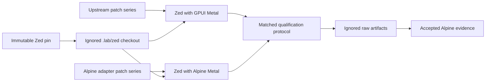

# Alpine Zed Lab

Alpine Zed Lab is the private GPL-3.0-or-later comparison environment for
qualifying Alpine GPUI against a pinned Zed application workload. It keeps Zed
source, assets, patches, and generated artifacts outside the proprietary Alpine
GPUI repository.

This repository is internal-only. No combined Zed and Alpine binary or artifact
may be distributed without legal review.

## Current status

The lab foundation pins Zed `v1.15.0` at
`e17dc4f9d50db73a458b64dcce50ecd4878b98a3` and establishes source-isolation,
license, and patch-series checks. The upstream GPUI Metal and Alpine Metal build
variants are not yet qualified. They remain incomplete until both build from
clean checkouts and pass the same semantic, visual, accessibility, lifecycle,
memory, and workload-identity gates.

## Boundaries



- Zed is provisioned from its upstream remote into ignored `.lab/zed` storage.
- Reviewed variant patches live in `patches/` and are applied to disposable
  worktrees.
- Raw runs live in ignored `artifacts/` storage.
- Only exact findings, protocol records, and accepted evidence cross into Alpine.
- Zed source, Zed assets, and GPL-derived patches never enter Alpine GPUI.

## Verification

Run repository checks without network access:

```sh
scripts/check.sh
```

Verify that the immutable tag still resolves to the recorded commit:

```sh
scripts/check-pin.sh --network
```

Provision the exact detached Zed checkout into ignored storage:

```sh
scripts/provision-zed.sh
```

The command is idempotent for a matching checkout and fails instead of replacing
an existing mismatched path. Build variants and workload execution arrive through
later implementation tasks. A passing policy check does not imply renderer
equivalence or performance superiority.

## Authority

- Alpine Capability: <https://github.com/dbuddha/alpine-gpui/issues/28>
- Lab Requirement: <https://github.com/dbuddha/alpine-gpui/issues/31>
- Foundation Task: <https://github.com/dbuddha/alpine-gpui/issues/43>
- Pinned research: <https://github.com/dbuddha/alpine-gpui/issues/27>
- Isolation decision: <https://github.com/dbuddha/alpine-gpui/issues/41>
- License: [GPL-3.0-or-later](LICENSE)
