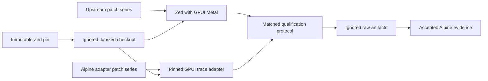

# Alpine Zed Lab

Alpine Zed Lab is the public GPL-3.0-or-later comparison environment for
qualifying Alpine GPUI against a pinned Zed application workload. It keeps Zed
source, assets, patches, and generated artifacts outside the public,
proprietary Alpine GPUI repository.

This project does not publish a combined Zed and Alpine binary. Anyone who
distributes one is responsible for satisfying the applicable GPL and third-party
license obligations.

## Current status

The lab pins Zed `v1.15.0` at
`e17dc4f9d50db73a458b64dcce50ecd4878b98a3` and Alpine at
`b1e51a62da7e87a28367973591f235543f1df14b`. It establishes source isolation,
license checks, immutable trace identity, and reviewed patch-series checks. The
first GPL adapter decodes the current solid-quad trace slice into a GPUI scene
and renders it through pinned GPUI Metal. Pull requests and the weekly schedule
run coverage ratchets and exhaustive adapter mutation testing. Renderer-only
timing remains disabled until clean offline-shader CI and hardware calibration
qualify it.

Every accepted qualification manifest records the clean lab revision that
generated it alongside the exact Zed and Alpine revisions. Runs from a lab
worktree with tracked, uncommitted changes fail before evidence is emitted.

## Boundaries



- Zed is provisioned from its upstream remote into ignored `.lab/zed` storage.
- Reviewed variant patches live in `patches/` and are applied to disposable
  worktrees.
- Raw runs live in ignored `artifacts/` storage.
- Only exact findings, protocol records, and accepted evidence cross into Alpine.
- Zed source, Zed assets, and GPL-derived patches never enter Alpine GPUI.

## Verification

Run repository checks without network access:

```sh
scripts/check.sh
```

Verify that the immutable tag still resolves to the recorded commit:

```sh
scripts/check-pin.sh --network
```

Provision the exact detached Zed and Alpine checkouts into ignored storage:

```sh
scripts/provision-zed.sh
scripts/provision-alpine.sh
```

The commands are idempotent for matching checkouts and fail instead of replacing
an existing mismatched path. On an Apple Silicon Mac with the Metal compiler,
run the untimed correctness comparison with:

```sh
scripts/run-renderer-equivalence.sh artifacts/local-equivalence
```

When only Command Line Tools are installed, local development can compile GPUI
shaders at runtime:

```sh
ALPINE_ZED_RUNTIME_SHADERS=1 scripts/run-renderer-equivalence.sh artifacts/local-runtime-shaders
```

Runtime shader mode is supporting evidence only and is marked unqualified in
the generated manifest. A passing comparison establishes exact pixels only for
the pinned trace. It does not establish full primitive coverage, lifecycle or
resource equivalence, application parity, or performance superiority.

To reproduce the source-assurance gates locally, install the pinned
`cargo-llvm-cov` and `cargo-mutants` versions shown in CI, then run:

```sh
ALPINE_ZED_RUNTIME_SHADERS=1 \
ALPINE_ZED_COVERAGE=1 \
ALPINE_ZED_MUTATION=1 \
scripts/run-renderer-equivalence.sh artifacts/local-deep-assurance
```

The coverage gate currently requires at least 95% line coverage and 90%
function coverage. Mutation succeeds only when every generated adapter mutant
is caught or cannot compile. These are assertion-strength gates, not substitutes
for exact readback equivalence.

Hosted CI reads the public Alpine revision without a cross-repository secret.
Hosted Apple Silicon checks run the pinned GPUI Metal result against the Alpine
CPU oracle. Direct Metal comparison remains a physical-hardware gate because
Alpine intentionally rejects GitHub's virtual Metal device as a supported
production target.

## Authority

- Alpine Capability: <https://github.com/dbuddha/alpine-gpui/issues/28>
- Lab Requirement: <https://github.com/dbuddha/alpine-gpui/issues/31>
- Foundation Task: <https://github.com/dbuddha/alpine-gpui/issues/43>
- GPUI trace Task: <https://github.com/dbuddha/alpine-gpui/issues/61>
- Pinned research: <https://github.com/dbuddha/alpine-gpui/issues/27>
- Isolation decision: <https://github.com/dbuddha/alpine-gpui/issues/41>
- License: [GPL-3.0-or-later](LICENSE)
