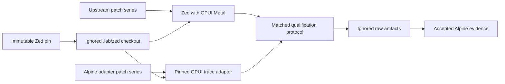

# Alpine Zed Lab

Alpine Zed Lab is the public GPL-3.0-or-later comparison environment for
qualifying Alpine GPUI against a pinned Zed application workload. It keeps Zed
source, assets, patches, and generated artifacts outside the public,
proprietary Alpine GPUI repository.

This project does not publish a combined Zed and Alpine binary. Anyone who
distributes one is responsible for satisfying the applicable GPL and third-party
license obligations.

## Current status

The lab pins Zed `v1.15.0` at
`e17dc4f9d50db73a458b64dcce50ecd4878b98a3` and Alpine at
`2fdf5aa283e7d773203a76b394ed2e62428c16e4`. It establishes source isolation,
license checks, an immutable eight-fixture trace manifest, and reviewed
patch-series checks. The GPL adapter preserves the version 1 solid-quad control
and independently decodes version 2 clips, quads, one prepared A8 atlas,
monochrome glyphs, and two-step scroll and resize identities into GPUI scenes.
It uploads canonical atlas bytes through GPUI's existing atlas and uses an
explicit test-support clear color, so it performs no font shaping or
rasterization and adds no synthetic background draw. Pull requests and the
weekly schedule run coverage ratchets and exhaustive adapter mutation testing.
Renderer-only timing and memory remain disabled until semantic equivalence,
offline-shader CI, and hardware calibration qualify them.

The pinned companion `alpine-scene-trace-sequence/v1` now exercises initial
atlas admission, unchanged reuse, same-capacity content replacement, capacity
replacement, teardown, and full resynchronization through two GPUI Metal owner
generations. Warm reuse bypasses GPUI atlas admission. Replacement explicitly
removes the prior key before admitting the new immutable bytes. Evidence keeps
tile identity, adapter allocation and replacement counts, CPU-oracle deltas,
and terminal owner state. GPUI's public headless boundary does not expose native
Metal allocation bytes or completion residency, so those fields remain an
explicit omission rather than an inferred memory claim.

Every accepted qualification manifest records the clean lab revision that
generated it alongside the exact Zed and Alpine revisions. Runs from a lab
worktree with tracked, uncommitted changes fail before evidence is emitted.
Hosted qualification artifacts are retained for 90 days, and repository policy
fails if that evidence window drifts.

## Boundaries



- Zed is provisioned from its upstream remote into ignored `.lab/zed` storage.
- Reviewed variant patches live in `patches/` and are applied to disposable
  worktrees.
- Raw runs live in ignored `artifacts/` storage.
- Only exact findings, protocol records, and accepted evidence cross into Alpine.
- Zed source, Zed assets, and GPL-derived patches never enter Alpine GPUI.

## Verification

Run repository checks without network access:

```sh
scripts/check.sh
```

Verify that the immutable tag still resolves to the recorded commit:

```sh
scripts/check-pin.sh --network
```

Provision the exact detached Zed and Alpine checkouts into ignored storage:

```sh
scripts/provision-zed.sh
scripts/provision-alpine.sh
```

The commands are idempotent for matching checkouts and fail instead of replacing
an existing mismatched path. On an Apple Silicon Mac with the Metal compiler,
run the untimed correctness comparison with:

```sh
scripts/run-renderer-equivalence.sh artifacts/local-equivalence
```

When only Command Line Tools are installed, local development can compile GPUI
shaders at runtime:

```sh
ALPINE_ZED_RUNTIME_SHADERS=1 scripts/run-renderer-equivalence.sh artifacts/local-runtime-shaders
```

Runtime shader mode is supporting evidence only and is marked unqualified in
the generated manifests. A passing set establishes CPU-oracle agreement within
one BGRA8 channel unit for the eight pinned prepared scenes and all five visible
atlas-lifecycle steps. A full physical run also executes Alpine's independently
validated Direct Metal lifecycle sequence and requires the eight static Alpine
Direct Metal and GPUI Metal readbacks to be byte-identical. Every
fixture retains its CPU, GPUI Metal, and, when physically run, Alpine Direct
Metal readback plus the observed oracle delta, adaptation counters, and pair
identity. Lifecycle evidence establishes bounded adapter admissions, GPUI tile
identity, teardown, reconstruction, and pixel equivalence. It does not establish
native GPUI allocation-byte equivalence, full primitive coverage, application
parity, timing, memory, or superiority.

### Renderer timing samples

The pinned adapter can emit bounded raw GPUI Metal samples after semantic
admission and declared warmup iterations:

```sh
alpine_trace_adapter --benchmark TRACE OUTPUT.csv WARMUPS SAMPLES
```

The command reuses one prepared GPUI scene and one headless renderer, measures
only renderer submission through synchronous offscreen readback, and publishes
the strict `sample_index,elapsed_ns` CSV without replacement. Its summary
separates adaptation counters, one semantic admission iteration, declared
warmups, clock identity, and sample count. These samples are calibration input,
not performance qualification or evidence of a product-level claim. Offline
metallib mode is required; runtime-source shaders are rejected.

For diagnosis, the adapter also exposes a separate observer-perturbed stage
path:

```sh
alpine_trace_adapter --profile TRACE OUTPUT.csv WARMUPS SAMPLES
```

It records target and intermediate-resource preparation, instance writes,
command-buffer acquisition, render encoding, discrete-memory readback encoding
when required, commit, completion wait, Metal GPU execution when available,
readback compaction, and total time. Optional stages carry explicit availability
markers rather than fabricated zero durations. This path performs an independent
semantic admission and checks every warmup and measured image against it. The
ordinary `--benchmark` path contains no stage probes and is never corrected by
subtracting profile stages. Profile output is explanatory E3 input only; it is
not timing qualification or evidence that either renderer is faster.

To reproduce the source-assurance gates locally, install the pinned
`cargo-llvm-cov` and `cargo-mutants` versions shown in CI, then run:

```sh
ALPINE_ZED_RUNTIME_SHADERS=1 \
ALPINE_ZED_COVERAGE=1 \
ALPINE_ZED_MUTATION=1 \
scripts/run-renderer-equivalence.sh artifacts/local-deep-assurance
```

The coverage gate currently requires at least 95% line coverage and 90%
function coverage. Mutation succeeds only when every generated adapter mutant
is caught or cannot compile. These are assertion-strength gates, not substitutes
for bounded oracle and exact Metal-to-Metal readback equivalence.

Hosted CI reads the public Alpine revision without a cross-repository secret.
Hosted Apple Silicon checks run the pinned GPUI Metal result against the Alpine
CPU oracle. Direct Metal comparison remains a physical-hardware gate because
Alpine intentionally rejects GitHub's virtual Metal device as a supported
production target.

### Paired renderer calibration inputs

Task #478 adds one fail-closed command with capture and compose phases. Capture
requires a clean lab revision, the exact pinned Alpine and Zed identities, a
leased physical Apple Silicon window, offline shaders, and retained exact Metal
equivalence for the selected trace. It executes independent Alpine A/A, GPUI
A/A, and seeded cross-renderer AB/BA lanes while retaining every invocation and
keeping GPUI adaptation counters outside renderer elapsed samples.

    scripts/run-paired-renderer-samples.sh capture [arguments]
    scripts/run-paired-renderer-samples.sh compose [arguments]

Compose rejects fewer than twenty complete runs, fewer than four independent
windows, duplicate seeds or leases, malformed samples, one-sided order,
identity or stage drift, partial bundles, artifact replacement, and mixed
environment classes. It emits two manifests accepted by Alpine's
alpine-aa-calibration/v1 validator plus a separate cross-renderer raw artifact.
The hosted control uses explicit test-fixture windows and deterministic fake
samplers, so it proves protocol shape only. Physical distributions, confidence
intervals, residency, E4 qualification, and every performance claim remain
owned by Alpine Tasks #470 through #472 and Requirement #53.

## Authority

- Alpine Capability: <https://github.com/dbuddha/alpine-gpui/issues/28>
- Lab Requirement: <https://github.com/dbuddha/alpine-gpui/issues/31>
- Atlas lifecycle qualification: <https://github.com/dbuddha/alpine-gpui/issues/353>
- Foundation Task: <https://github.com/dbuddha/alpine-gpui/issues/43>
- GPUI trace Task: <https://github.com/dbuddha/alpine-gpui/issues/61>
- Pinned research: <https://github.com/dbuddha/alpine-gpui/issues/27>
- Isolation decision: <https://github.com/dbuddha/alpine-gpui/issues/41>
- License: [GPL-3.0-or-later](LICENSE)
